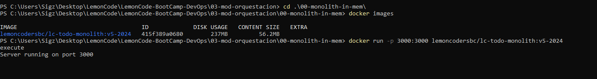
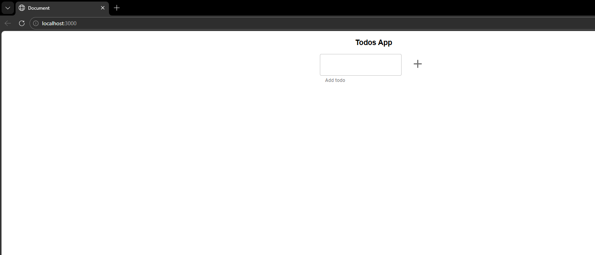
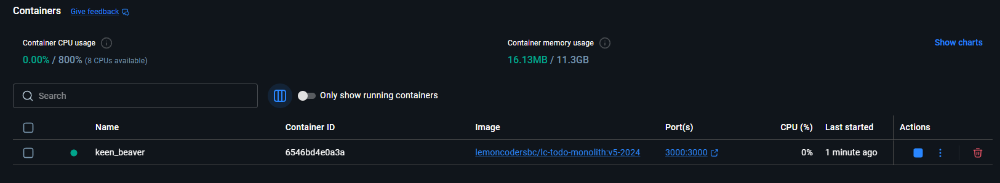
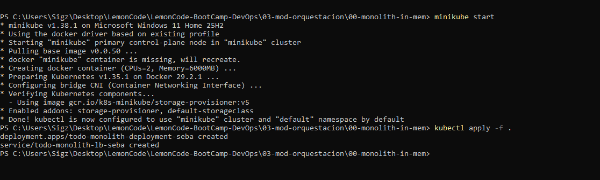
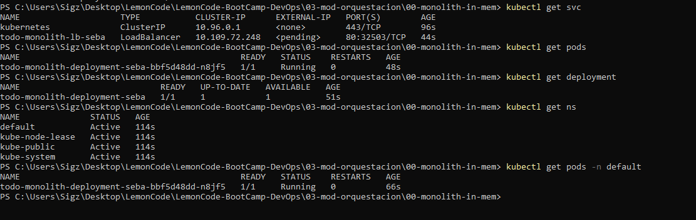
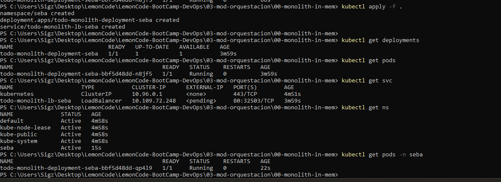
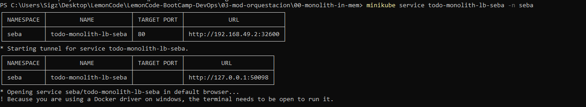
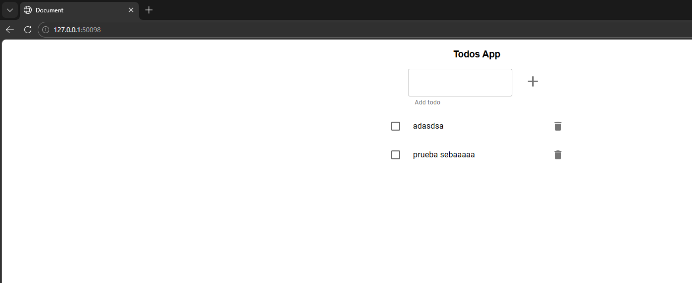

Lo primero, desde docker hub hago un pull de la imagen: lemoncodersbc/lc-todo-monolith:v5-2024

docker images para revisar si esta la imagen y la ejecutamos localmente

```bash
docker images
```

```bash
docker run -p 3000:3000 lemoncodersbc/lc-todo-monolith:v5-2024
```



Lo que hago ahora es desde docker ver mas o menos cuanto consume



Uso eso para setear los request y le doy un poquito mas para los limites. Tambien agrego liveness y readiness probes

Hacemos un 

```bash
minikube start
```



```bash
kubectl apply -f .
```
Ejecuto los siguientes commandos:

```bash
kubectl get deployments
kubectl get pods
kubectl get svc
kubectl get ns
kubectl get pods -n default
```


Me di cuenta que no especifique namespace.

Agrego namespace "seba" en el deployment.yaml y "kubectl apply -f ." de nuevo



Ejecuto "minikube service todo-monolith-lb-seba -n seba" para ver como entrar al service

```bash
minikube service todo-monolith-lb-seba -n seba
```


