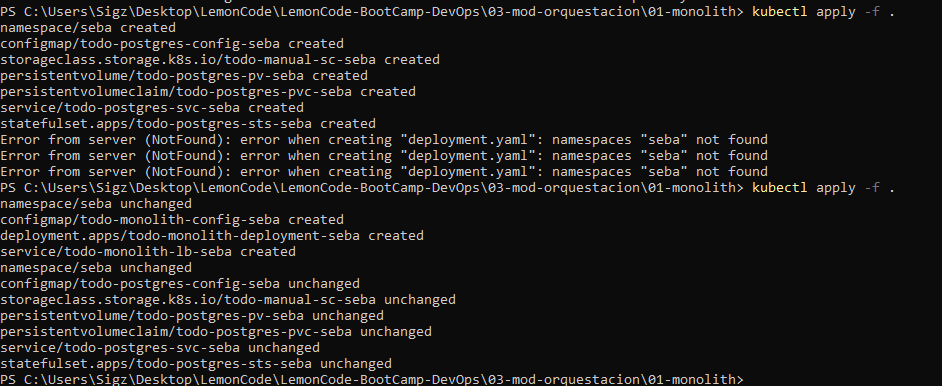
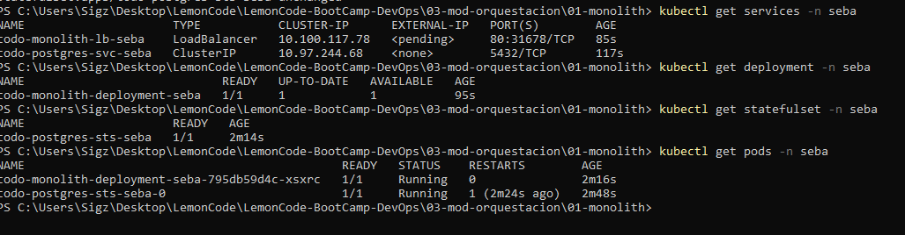
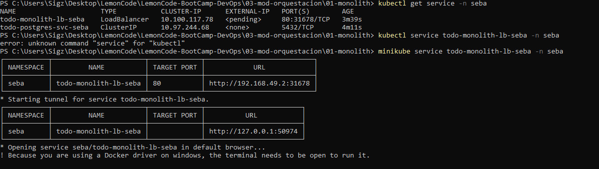
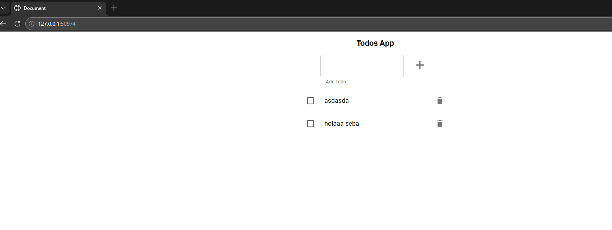
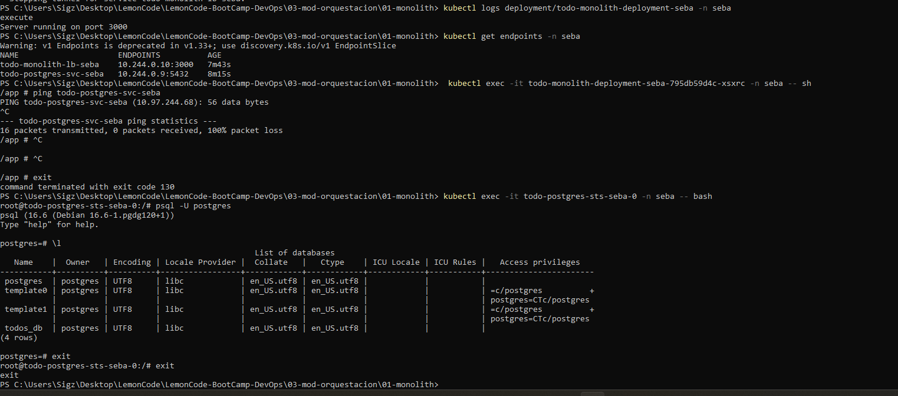
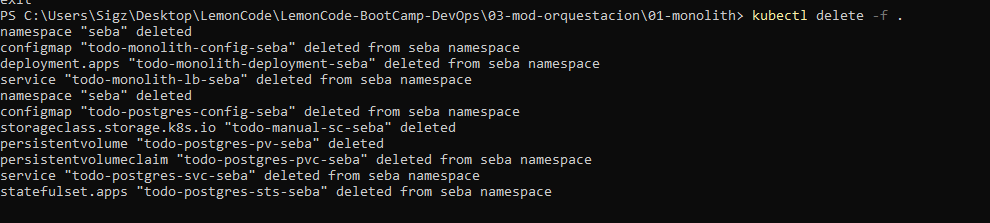

Genero el postgress.yaml, para las readiness y liveness probes use los comandos sacados de aca: https://www.postgresql.org/docs/current/app-pg-isready.html
Agarre el deployment.yaml del ejercicio anterior y lo modifique con el configmap

Ejecuto desde la raiz:

```bash
kubectl apply -f .
```



Nota: en la captura se ven dos apply -f, me habia olvidado de poner el ns en el deployment.yaml

Reviso que este todo ok:

```bash
kubectl get services -n seba
kubectl get deployment -n seba
kubectl get statefulset -n seba
kubectl get pods -n seba
```



Accedo al LB:

```bash
minikube service todo-monolith-lb-seba -n seba
```



Web:



Nota: No me quedo claro si tenia que aparecer algo mas por la conexion a la base con la app asi que por las dudas revise que estuviese bien la conexion y que exista la base:

```bash
kubectl logs deployment/todo-monolith-deployment-seba -n seba
kubectl get endpoints -n seba
```

```bash
kubectl exec -it todo-monolith-deployment-seba-795db59d4c-xsxrc -n seba -- sh
PING todo-postgres-svc-seba
```

```bash
kubectl exec -it todo-postgres-sts-seba-0 -n seba -- bash
\l
```



Ejecuto el siguiente comando para borrar todo:

```bash
kubectl delete -f .
```


