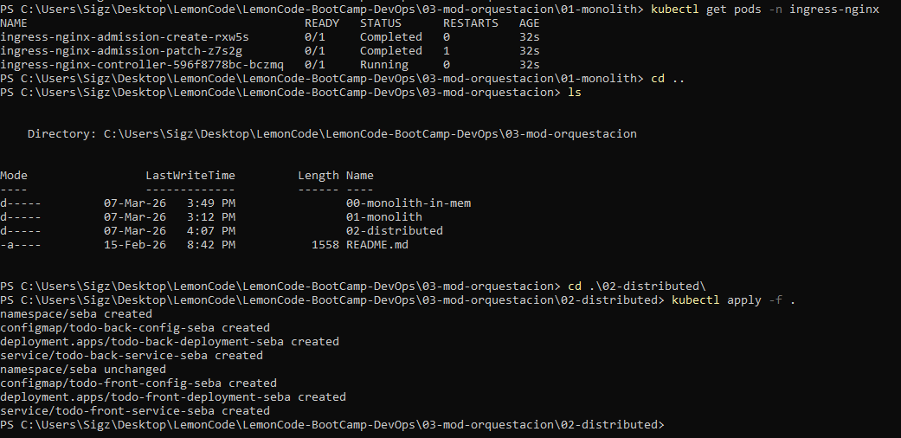
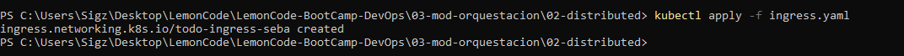
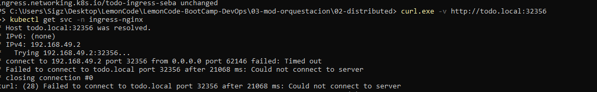
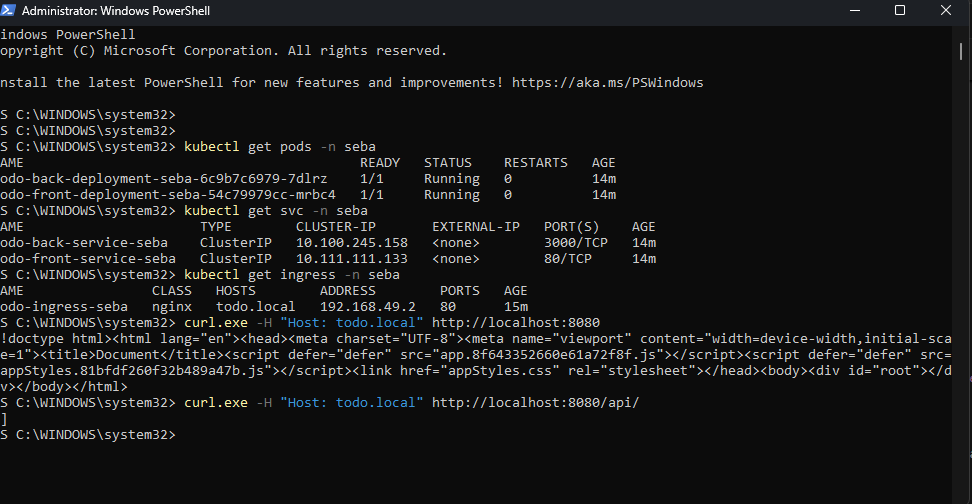
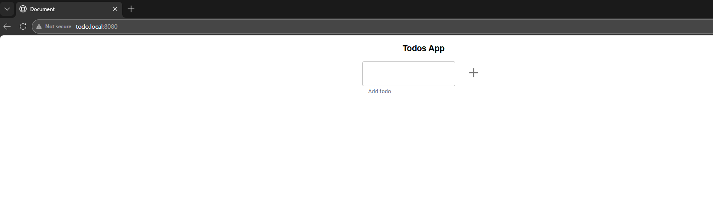
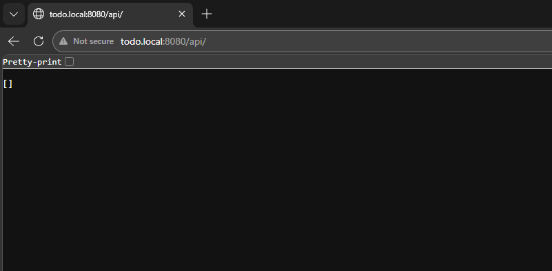

Generamos dos yaml, uno para el frontend y otro para el backend.
Ejecutamos:

```bash
minikube addons enable ingress
```

Verificamos:

```bash
kubectl get pods -n ingress-nginx
```

Creamos el ingress.yaml y aplicamos todos los files:

```bash
kubectl apply -f .
```



Por algun motivo no me creo el ingress.yaml, asi que...:

```bash
kubectl apply -f ingress.yaml
```




Ahora ejecutamos:

```bash
kubectl get ingress -n seba
```

Entiendo que al querer hacer un ingress, vamos a probar DNS en vez de por IP como veniamos haciendo por lo tanto, al estar local, voy al archivo host de windows:

```bash
C:\Windows\System32\drivers\etc\hosts
```

Y agrego: 

```bash
192.168.49.2   todo.local
```

Chequeamos que este todo ok:

```bash
kubectl get pods -n seba
kubectl get endpoints -n seba
kubectl get ingress -n seba
```

Ejecutamos:

```bash
minikube tunnel
```

***troubleshooting intenso de 2 horas ya que no se podia entrar a ninguna api en todo.local/ o todo.local/api***



Se me ocurrio ejecutar el siguiente comando ya que no habia forma de ingresar a la app, sospecho de algun problema de conectividad entre windows 11 y minikube o docker:

```bash
kubectl port-forward -n ingress-nginx service/ingress-nginx-controller 8080:80
```

Tambien cambie el host por:

```bash
127.0.0.1 todo.local
```

```bash
kubectl get pods -n seba
kubectl get svc -n seba
kubectl get ingress -n seba
curl.exe -H "Host: todo.local" http://localhost:8080
curl.exe -H "Host: todo.local" http://localhost:8080/api/

```


Front:


Back:

