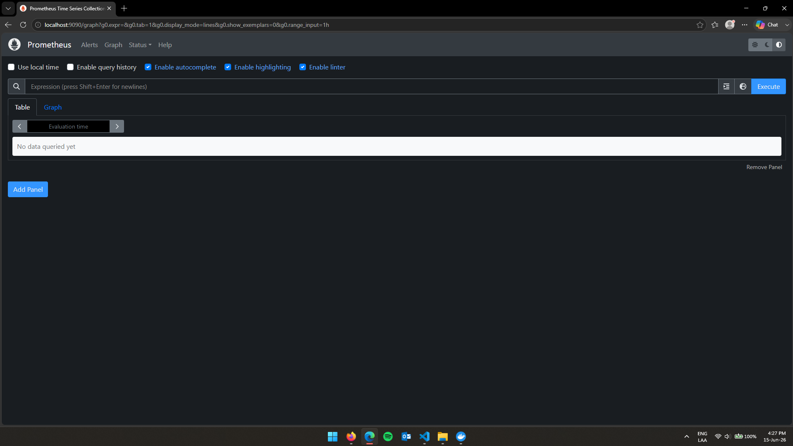
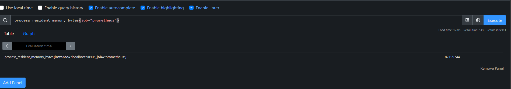
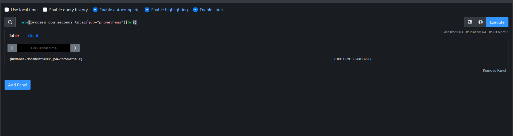
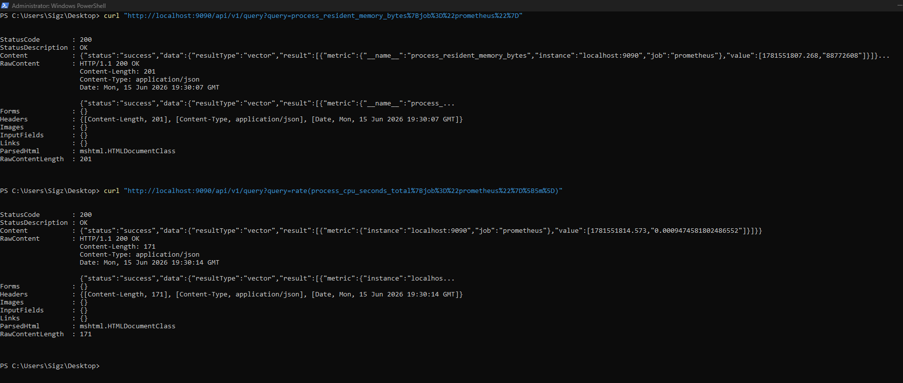
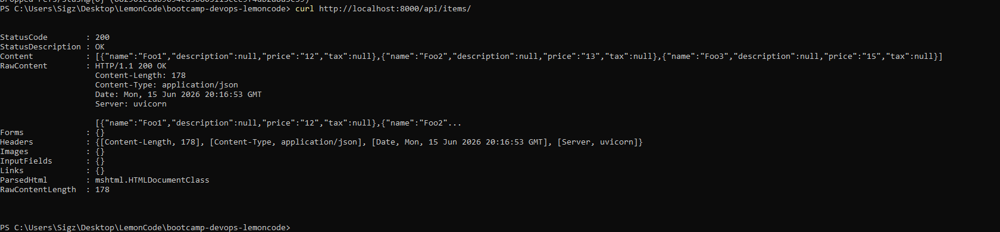
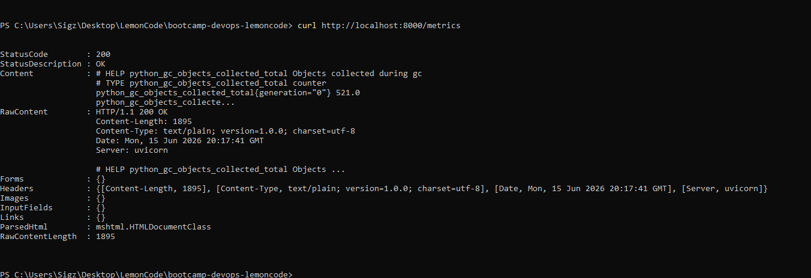
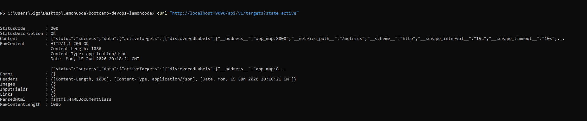

# Ejercicio 1 - Prometheus local con Docker

Creamos una configuracion minima para que Prometheus haga scraping de si mismo.

Archivo `prometheus.yml`:

```yaml
global:
  scrape_interval: 15s
  evaluation_interval: 15s

scrape_configs:
  - job_name: "prometheus"
    static_configs:
      - targets:
          - "localhost:9090"
```

Levantamos Prometheus con Docker Compose:

```bash
docker compose up -d
```

Verificamos que el contenedor este funcionando:

```bash
docker ps
```

Entramos al cliente web de Prometheus:

```bash
http://localhost:9090
```


Query sobre memoria utilizada por Prometheus:

```promql
process_resident_memory_bytes{job="prometheus"}
```

Resultado obtenido:

```text

process_resident_memory_bytes{instance="localhost:9090", job="prometheus"} 87199744
```



Query sobre CPU utilizada por Prometheus:

```promql
rate(process_cpu_seconds_total{job="prometheus"}[5m])
```

Resultado obtenido:

```text
rate(process_cpu_seconds_total{job="prometheus"}[5m]) 0.0011229133988132206
```



Tambien podemos probar las queries desde la API:

```bash
curl "http://localhost:9090/api/v1/query?query=process_resident_memory_bytes%7Bjob%3D%22prometheus%22%7D"
```

```bash
curl "http://localhost:9090/api/v1/query?query=rate(process_cpu_seconds_total%7Bjob%3D%22prometheus%22%7D%5B5m%5D)"
```




# Ejercicio 2 - Exporters, recording rules y alert rules

## Exporters

Los exporters son servicios que exponen metricas en un formato que Prometheus puede leer.

Prometheus normalmente no obtiene metricas entrando directamente en cada sistema, sino haciendo scraping sobre un endpoint HTTP, normalmente `/metrics`.

Ejemplo:

```text
Prometheus -> scrape -> node_exporter -> metricas del sistema operativo
```

Algunos exporters comunes son:

```text
node_exporter      metricas de CPU, memoria, disco y red del sistema operativo
mysql_exporter     metricas de MySQL
postgres_exporter  metricas de PostgreSQL
blackbox_exporter  comprobaciones HTTP, TCP, ICMP, etc.
```

Por ejemplo, si queremos monitorizar una maquina Linux, instalamos `node_exporter`. Este exporter publica metricas como uso de CPU, memoria disponible, disco libre o trafico de red. Prometheus consulta esas metricas cada cierto tiempo y las guarda en su base de datos.

## Recording rules

Las recording rules son reglas que permiten guardar el resultado de una query PromQL como una nueva metrica.

Sirven para no repetir constantemente queries largas o costosas, especialmente en dashboards o consultas frecuentes.

Ejemplo de query:

```promql
rate(process_cpu_seconds_total[5m])
```

Podemos guardarla como una nueva metrica usando una recording rule:

```yaml
groups:
  - name: prometheus.rules
    rules:
      - record: prometheus:cpu_usage:rate5m
        expr: rate(process_cpu_seconds_total[5m])
```

Luego se puede consultar directamente:

```promql
prometheus:cpu_usage:rate5m
```

Esto mejora la reutilizacion de consultas y puede ayudar al rendimiento cuando las queries son complejas.

## Alert rules

Las alert rules son reglas que definen condiciones para generar alertas.

Prometheus evalua estas reglas periodicamente. Si la condicion se cumple durante el tiempo indicado, se dispara una alerta.

Ejemplo:

```yaml
groups:
  - name: prometheus.alerts
    rules:
      - alert: PrometheusDown
        expr: up{job="prometheus"} == 0
        for: 1m
        labels:
          severity: critical
        annotations:
          summary: "Prometheus no responde"
```

En este caso, si el target `prometheus` aparece como caido durante mas de 1 minuto, se genera la alerta `PrometheusDown`.

Normalmente Prometheus envia estas alertas a Alertmanager, que se encarga de agruparlas y notificarlas por canales como email, Slack o Teams.

Resumen:

```text
Exporters        exponen metricas para que Prometheus las recoja
Recording rules  guardan resultados de queries como nuevas metricas
Alert rules      disparan alertas cuando se cumple una condicion
```


# Ejercicio 3 - Contenido de la carpeta 01-start-up-loki

La carpeta `01-start-up-loki` contiene una configuracion para levantar en local un entorno de logs con Loki usando Docker Compose.

Los archivos principales son:

```text
docker-compose.yaml
loki-config.yaml
alloy-local-config.yaml
```

## docker-compose.yaml

Este archivo define todos los contenedores necesarios para arrancar el stack.

Servicios principales:

```text
read      nodo de Loki encargado de atender consultas de lectura
write     nodo de Loki encargado de recibir logs escritos
backend   nodo de Loki para tareas internas como compactor/backend
gateway   Nginx que actua como punto de entrada unico a Loki
minio     almacenamiento compatible con S3 para guardar los datos de Loki
grafana   interfaz web para consultar los logs
alloy     agente que recoge logs de Docker y los envia a Loki
flog      generador de logs de prueba
```

Tambien define una red llamada `loki`, para que todos los servicios puedan comunicarse entre si.

Loki se ejecuta dividido por roles:

```text
read     -target=read
write    -target=write
backend  -target=backend
```

Esto simula una arquitectura distribuida de Loki, separando lectura, escritura y tareas internas.

El servicio `gateway` usa Nginx y escucha en el puerto `3100`. Su funcion es redirigir las peticiones:

```text
/loki/api/v1/push  -> write
/loki/api/v1/tail  -> read
/loki/api/*        -> read
```

Grafana se expone en:

```text
http://localhost:3000
```

Y queda configurado automaticamente con Loki como datasource, apuntando al gateway:

```text
http://gateway:3100
```

## loki-config.yaml

Este archivo contiene la configuracion de Loki.

La seccion `server` indica que Loki escucha en el puerto `3100`:

```yaml
server:
  http_listen_address: 0.0.0.0
  http_listen_port: 3100
```

La seccion `memberlist` configura la comunicacion entre los nodos de Loki:

```text
read
write
backend
```

Esto permite que los componentes de Loki se descubran y formen parte del mismo cluster.

La seccion `schema_config` define como se guardan los logs e indices. En este caso usa:

```text
store: tsdb
object_store: s3
schema: v13
```

Es decir, Loki guarda los datos usando el formato TSDB y un almacenamiento compatible con S3.

La seccion `common.storage.s3` apunta a MinIO:

```yaml
endpoint: minio:9000
bucketnames: loki-data
access_key_id: loki
secret_access_key: supersecret
```

MinIO actua como si fuera S3, pero corriendo localmente en Docker.

Tambien se configura el `ruler`, usando otro bucket:

```text
loki-ruler
```

Y el `compactor`, que trabaja en:

```text
/tmp/compactor
```

## alloy-local-config.yaml

Este archivo configura Grafana Alloy.

Alloy funciona como agente recolector de logs. En este ejercicio lee logs de los contenedores Docker y los envia a Loki.

Primero descubre contenedores Docker:

```hcl
discovery.docker "flog_scrape" {
  host = "unix:///var/run/docker.sock"
  refresh_interval = "5s"
}
```

Luego agrega una etiqueta con el nombre del contenedor:

```hcl
target_label = "container"
```

Despues usa `loki.source.docker` para leer los logs de Docker:

```hcl
loki.source.docker "flog_scrape" {
  host       = "unix:///var/run/docker.sock"
  forward_to = [loki.write.default.receiver]
}
```

Finalmente envia los logs a Loki a traves del gateway:

```hcl
loki.write "default" {
  endpoint {
    url       = "http://gateway:3100/loki/api/v1/push"
    tenant_id = "tenant1"
  }
}
```

El `tenant_id` usado es:

```text
tenant1
```

Ese mismo tenant se configura en Grafana mediante la cabecera:

```text
X-Scope-OrgID: tenant1
```

## Resumen del flujo

El flujo completo es:

```text
flog genera logs
Docker guarda los logs del contenedor
Alloy lee los logs desde Docker
Alloy envia los logs al gateway
Gateway reenvia los logs al servicio write de Loki
Loki guarda los datos en MinIO
Grafana consulta Loki a traves del gateway
```

En resumen, esta carpeta sirve para levantar un laboratorio local de logging con Loki, Grafana, Alloy y MinIO.


# Ejercicio 4 - Estructura de una traza en Jaeger

Jaeger es una herramienta de tracing distribuido. Sirve para seguir el recorrido de una peticion a traves de varios servicios.

Una traza representa una operacion completa dentro de un sistema. Por ejemplo, una peticion HTTP que entra por un frontend, llama a una API, consulta una base de datos y devuelve una respuesta.

<h2 style="color:#0b63ce">Trace / Traza</h2>

Una `trace` es el conjunto completo de eventos relacionados con una misma peticion.

Ejemplo:

```text
GET /checkout
```

Esa peticion podria pasar por varios servicios:

```text
frontend -> orders-api -> payments-api -> database
```

Todo ese recorrido completo forma una traza.

Cada traza tiene un identificador unico llamado `traceID`.

<h2 style="color:#0b63ce">Span</h2>

Un `span` representa una unidad de trabajo dentro de una traza.

Por ejemplo:

```text
Recibir request en frontend
Llamar a orders-api
Consultar base de datos
Llamar a payments-api
```

Cada una de esas operaciones seria un span.

Un span suele incluir:

```text
spanID       identificador unico del span
traceID      identificador de la traza a la que pertenece
operation    nombre de la operacion
start time   momento en el que empieza
duration     cuanto tarda
tags         metadata de la operacion
logs         eventos dentro del span
references   relacion con otros spans
```

<h2 style="color:#d35400">Relacion padre-hijo</h2>

Los spans se organizan de forma jerarquica.

Normalmente hay un span principal, llamado root span, que representa la operacion inicial.

Luego aparecen spans hijos para las operaciones que ocurren dentro de esa peticion.

Ejemplo:

```text
Trace: GET /checkout

root span: frontend GET /checkout
  child span: orders-api GET /orders
    child span: database SELECT orders
  child span: payments-api POST /payment
```

Esto permite ver que servicio llamo a cual, cuanto tardo cada parte y donde puede haber un problema.

<h2 style="color:#0b63ce">Scope</h2>

El `scope` representa el contexto desde el que se genero la instrumentacion.

En tracing moderno, especialmente con OpenTelemetry, el scope suele indicar que libreria, modulo o componente creo los spans.

Ejemplo:

```text
scope.name=orders-api
scope.version=1.0.0
```

Sirve para saber de donde vienen los spans, que version de instrumentacion los genero y separar mejor la informacion cuando una aplicacion usa varias librerias instrumentadas.

<h2 style="color:#0b63ce">Tags</h2>

Los `tags` son pares clave-valor que agregan informacion al span.

Ejemplos:

```text
http.method=GET
http.status_code=200
service.name=orders-api
db.system=postgresql
db.statement=SELECT * FROM orders
```

Sirven para filtrar, buscar y entender mejor cada operacion.

<h2 style="color:#d35400">Logs dentro de un span</h2>

Un span tambien puede contener logs o eventos internos.

Ejemplo:

```text
request_received
db_query_started
db_query_finished
response_sent
```

Estos eventos ayudan a entender que paso dentro de una operacion concreta.

<h2 style="color:#d35400">Timeline</h2>

Jaeger muestra las trazas como una linea de tiempo.

Cada span aparece como una barra horizontal. La longitud de la barra representa la duracion del span.

Esto permite ver rapidamente:

```text
que servicio tardo mas
que llamadas ocurrieron en paralelo
que llamadas ocurrieron una despues de otra
donde se produjo un error
```

<h2 style="color:#d35400">Ejemplo de estructura</h2>

Una traza podria verse asi:

```text
traceID: abc123

spanID: 1
operation: GET /checkout
service: frontend
duration: 500ms

  spanID: 2
  parent: 1
  operation: GET /orders
  service: orders-api
  duration: 250ms

    spanID: 3
    parent: 2
    operation: SELECT orders
    service: database
    duration: 120ms

  spanID: 4
  parent: 1
  operation: POST /payment
  service: payments-api
  duration: 180ms
```

<h2 style="color:#d35400">Resumen</h2>

`Trace / traza`: recorrido completo de una peticion.

`Span`: una operacion concreta dentro de la traza.

`Scope`: contexto o libreria que genero la instrumentacion.

`Tags`: metadata para describir la operacion.

`traceID`: identificador comun para toda la traza.

`spanID`: identificador unico de cada span.

`parent`: relacion entre spans.

`logs`: eventos internos de un span.

`timeline`: visualizacion temporal de todos los spans.

En resumen, una traza en Jaeger permite entender como viaja una peticion por un sistema distribuido y detectar donde se producen latencias, errores o cuellos de botella.


# Ejercicio 5.1 - Setup con Prometheus y app FastAPI

Para este ejercicio se crea un setup con Docker Compose que levanta:

```text
app_map     aplicacion FastAPI del repositorio non-political-map
prometheus  servicio Prometheus que scrapea la aplicacion
```

La aplicacion usada es la carpeta `app_map` del repositorio:

```text
https://github.com/JaimeSalas/non-political-map/tree/main/app_map
```

## Cambios en la app

Se instalo la libreria cliente de Prometheus para Python:

```text
prometheus_client==0.23.1
```

En `main.py` se agrego el endpoint `/metrics` usando el cliente de Prometheus:

```python
from fastapi import FastAPI, Response
from prometheus_client import CONTENT_TYPE_LATEST, generate_latest, make_asgi_app


@app.get("/metrics", include_in_schema=False)
def metrics():
    return Response(generate_latest(), media_type=CONTENT_TYPE_LATEST)


metrics_app = make_asgi_app()
app.mount("/metrics", metrics_app)
```

Esto expone metricas por defecto de Python y del proceso, por ejemplo:

```text
python_gc_objects_collected_total
python_info
process_virtual_memory_bytes
process_resident_memory_bytes
process_cpu_seconds_total
```

## Dockerfile de la app

Se creo un `Dockerfile` dentro de `app_map`:

```dockerfile
FROM python:3.13-slim

WORKDIR /app

COPY requirements.txt .
RUN pip install --no-cache-dir -r requirements.txt

COPY . .

EXPOSE 8000

CMD ["uvicorn", "main:app", "--host", "0.0.0.0", "--port", "8000"]
```

## Docker Compose

Nota: para este ejercicio se extendio el `compose.yaml` creado en el ejercicio 1. Es decir, se mantiene el servicio `prometheus` y se agrega el servicio `app_map`.

```yaml
services:
  app_map:
    build:
      context: ./app_map
    container_name: app_map_seba
    ports:
      - "8000:8000"

  prometheus:
    image: prom/prometheus:v2.55.1
    container_name: prometheus_seba
    ports:
      - "9090:9090"
    volumes:
      - ./prometheus.yml:/etc/prometheus/prometheus.yml:ro
    command:
      - "--config.file=/etc/prometheus/prometheus.yml"
    depends_on:
      - app_map
```

## Configuracion de Prometheus

Tambien se extendio el `prometheus.yml` del ejercicio 1. Se mantiene el job original de Prometheus y se agrega un nuevo job para la app:

```yaml
scrape_configs:
  - job_name: "prometheus"
    static_configs:
      - targets:
          - "localhost:9090"

  - job_name: "app_map"
    static_configs:
      - targets:
          - "app_map:8000"
```

El target usa el nombre del servicio de Docker Compose:

```text
app_map:8000
```

Prometheus scrapea por defecto:

```text
http://app_map:8000/metrics
```

## Comandos ejecutados

Levantamos el entorno:

```bash
docker compose up -d --build
```

Probamos que la app responde:

```bash
curl http://localhost:8000/api/items/
```



Probamos que expone metricas:

```bash
curl http://localhost:8000/metrics
```



Resultado parcial:

```text
# HELP python_info Python platform information
# TYPE python_info gauge
python_info{implementation="CPython",major="3",minor="13",patchlevel="14",version="3.13.14"} 1.0

# HELP process_resident_memory_bytes Resident memory size in bytes.
# TYPE process_resident_memory_bytes gauge
process_resident_memory_bytes 5.5205888e+07

# HELP process_cpu_seconds_total Total user and system CPU time spent in seconds.
# TYPE process_cpu_seconds_total counter
process_cpu_seconds_total 1.3499999999999999
```

## Verificacion del target en Prometheus

Desde Prometheus se puede consultar:

```promql
up{job="app_map"}
```

Resultado obtenido:

```text
up{instance="app_map:8000", job="app_map"} 1
```

Tambien se verifico el endpoint de targets de Prometheus:

```bash
curl "http://localhost:9090/api/v1/targets?state=active"
```



Resultado relevante:

```text
scrapeUrl: http://app_map:8000/metrics
health: up
lastError:
```

Con esto queda verificado que Prometheus alcanza correctamente la app y puede extraer sus metricas.


# Ejercicio 5.2 - Desafio Jaeger con HotROD

Para este ejercicio se siguio el tutorial:

```text
https://medium.com/opentracing/take-opentracing-for-a-hotrod-ride-f6e3141f7941
```

## Docker Compose

Se creo el archivo `hotrod-ejercicio5parte2/compose.yaml` para levantar Jaeger y HotROD:

```yaml
services:
  jaeger:
    image: jaegertracing/all-in-one:${JAEGER_VERSION:-1.63.0}
    container_name: jaeger_hotrod_seba
    ports:
      - "16686:16686"
      - "4317:4317"
      - "4318:4318"
    environment:
      - COLLECTOR_OTLP_ENABLED=true
    networks:
      - jaeger-hotrod

  hotrod:
    image: jaegertracing/example-hotrod:${HOTROD_VERSION:-1.63.0}
    container_name: hotrod_seba
    command: ["all"]
    ports:
      - "8080:8080"
      - "8083:8083"
    environment:
      - OTEL_EXPORTER_OTLP_ENDPOINT=http://jaeger:4318
    depends_on:
      - jaeger
    networks:
      - jaeger-hotrod

networks:
  jaeger-hotrod:
```

## Comandos ejecutados

Levantamos Jaeger y HotROD:

```bash
docker compose -f hotrod-ejercicio5parte2/compose.yaml up -d
```

O entrando en la carpeta del ejercicio:

```bash
cd hotrod-ejercicio5parte2
docker compose up -d
```

URLs:

```text
HotROD: http://localhost:8080
Jaeger: http://localhost:16686
```

Generamos una traza llamando al endpoint de dispatch:

```bash
curl "http://localhost:8080/dispatch?customer=123"
```

Respuesta obtenida:

```json
{"Driver":"T799815C","ETA":120000000000}
```

Consultamos servicios disponibles en Jaeger:

```bash
curl "http://localhost:16686/api/services"
```

Resultado obtenido:

```text
frontend
redis-manual
driver
mysql
customer
route
```

Consultamos trazas del servicio frontend:

```bash
curl "http://localhost:16686/api/traces?service=frontend&lookback=1h&limit=20"
```

Se obtuvo una traza con `traceID`:

```text
45dba15767836b554ec6215c777ae34d
```

## Issue encontrado al levantar Jaeger

Primero probe con la imagen:

```text
jaegertracing/jaeger:2.0.0
```

HotROD levantaba correctamente, pero no aparecian trazas en Jaeger.

En los logs de HotROD aparecia:

```text
traces export: Post "http://jaeger:4318/v1/traces": connect: connection refused
```

El problema era que esa imagen de Jaeger v2 estaba exponiendo el receptor OTLP HTTP como `localhost:4318` dentro del contenedor. Desde otro contenedor, HotROD no podia conectarse a ese `localhost`.

Solucion aplicada:

```text
Usar jaegertracing/all-in-one:1.63.0
Habilitar OTLP con COLLECTOR_OTLP_ENABLED=true
Mantener OTEL_EXPORTER_OTLP_ENDPOINT=http://jaeger:4318 en HotROD
```

Despues de ese cambio, Jaeger empezo a recibir trazas correctamente.

## Analisis de la traza

Al abrir la traza en Jaeger se ve el flujo completo de una peticion:

```text
frontend -> customer -> mysql
frontend -> driver -> redis-manual
frontend -> route
```

La peticion principal es:

```text
GET /dispatch
```

Servicios que aparecen en la traza:

```text
frontend      recibe la peticion principal
customer      obtiene datos del cliente
mysql         simula la consulta de datos del cliente
driver        busca conductores cercanos
redis-manual  simula lecturas en Redis
route         calcula rutas y tiempos estimados
```

## Issue 1 - Errores en Redis

En algunas trazas aparecen spans de Redis marcados con error.

En los logs se ve:

```text
redis timeout
Retrying GetDriver after error
```

Interpretacion:

```text
El servicio driver consulta Redis para obtener informacion de conductores.
Algunas llamadas fallan de forma simulada con timeout.
HotROD reintenta la operacion y finalmente puede completar la respuesta.
```

En Jaeger esto se detecta porque el span tiene:

```text
error=true
```

Conclusion:

```text
Jaeger permite encontrar rapidamente errores internos aunque la respuesta final sea exitosa.
Sin tracing, este timeout podria quedar escondido entre logs normales.
```

## Issue 2 - Latencia en MySQL

El tutorial muestra que al generar muchas requests concurrentes, el span de `mysql` puede tardar mucho mas.

La causa es una simulacion de una mala configuracion de pool de conexiones:

```text
Solo hay una conexion disponible.
Las requests concurrentes quedan esperando un lock.
El span de mysql crece mucho en duracion.
```

Solucion propuesta por el tutorial:

```text
Quitar el lock que simula una unica conexion.
Reducir el delay de MySQL de 300ms a 100ms.
Pensarlo como configurar correctamente el pool de conexiones.
```

Conclusion:

```text
La timeline de Jaeger permite ver que el cuello de botella esta en mysql y no en frontend.
```

## Issue 3 - Poca concurrencia en route

Despues de resolver el problema de MySQL, el tutorial muestra otro cuello de botella en el servicio `route`.

El problema no esta en `route`, sino en como `frontend` llama a `route`.

Se observa que las llamadas no se ejecutan todas en paralelo, sino en grupos pequeños.

Causa:

```text
RouteWorkerPoolSize = 3
```

Solucion propuesta:

```text
Aumentar el worker pool, por ejemplo a 100.
```

Conclusion:

```text
Jaeger ayuda a distinguir si el problema esta en el servicio llamado o en el servicio que organiza las llamadas.
En este caso, el cuello de botella esta en frontend por limitar la concurrencia hacia route.
```

## Comandos utiles

Ver logs de HotROD:

```bash
docker logs hotrod_seba
```

Ver logs de Jaeger:

```bash
docker logs jaeger_hotrod_seba
```