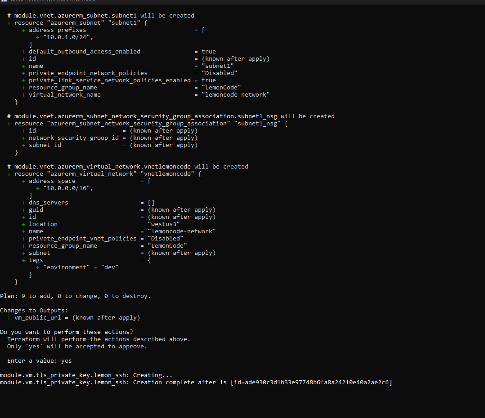
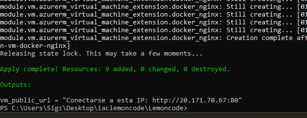
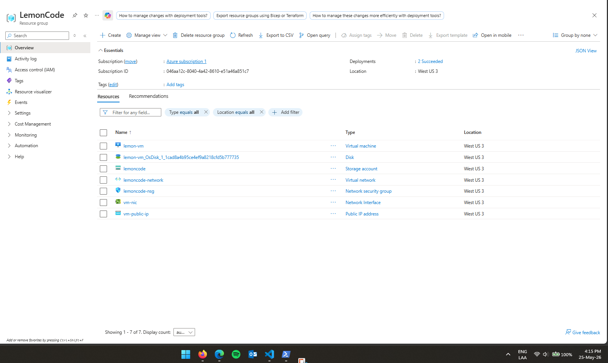
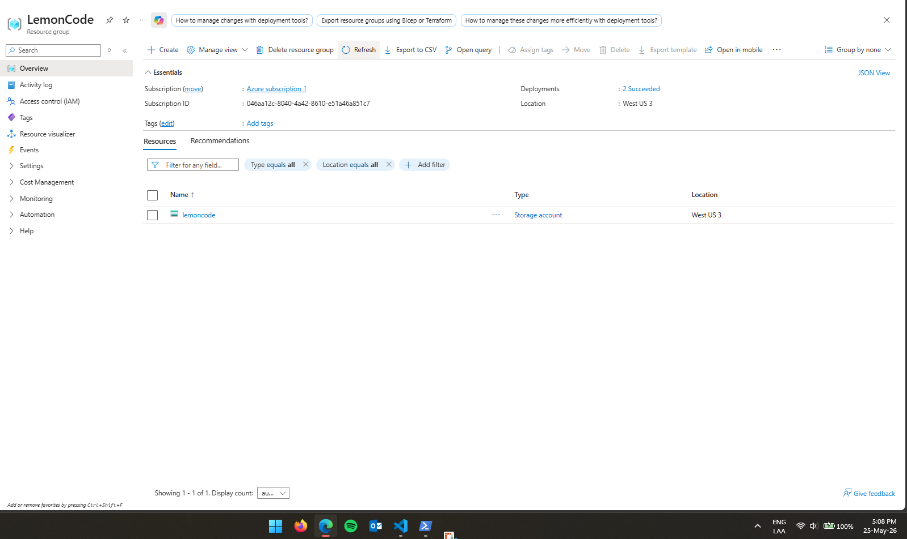
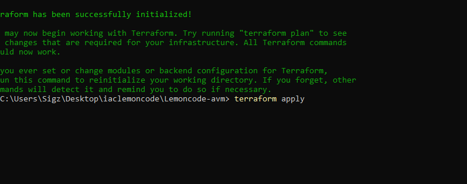
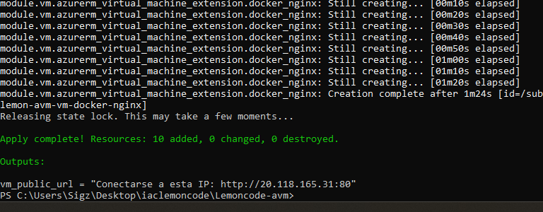
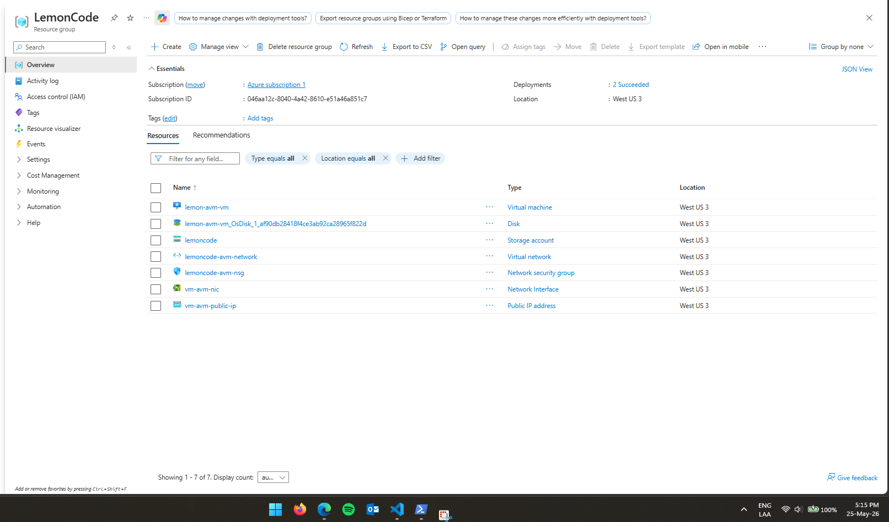
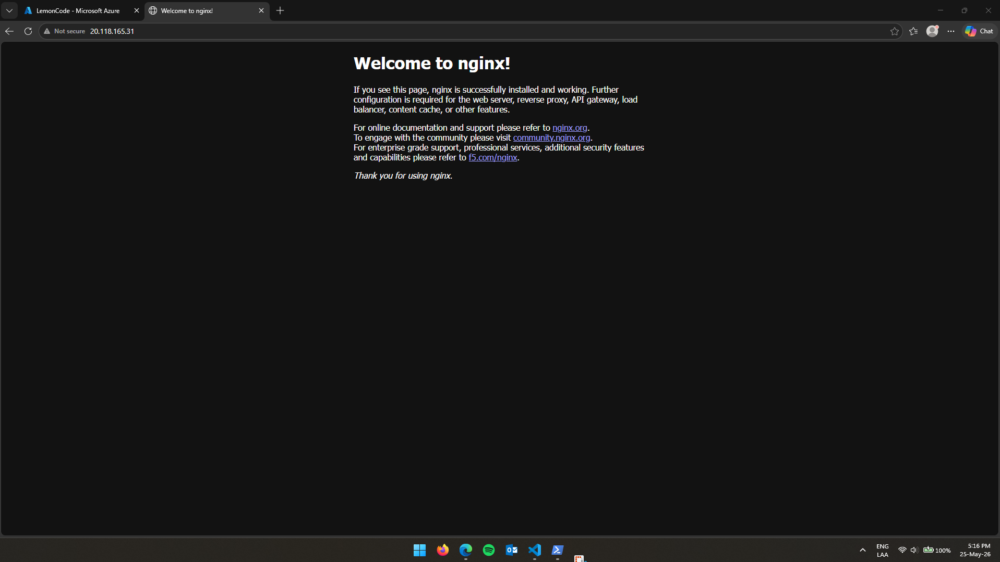

## Ejercicio 1 (puntos 1 al 7)


Ejecuto desde la raiz:

```bash
terraform init
terraform plan
terraform apply
```







Validamos con la ip creada que podamos visualizar el Nginx


## Ejercicio 2 (punto 8)



```bash
terraform init
terraform plan
terraform apply
```







Validamos con la ip creada que podamos visualizar el Nginx

